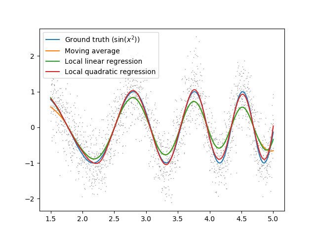
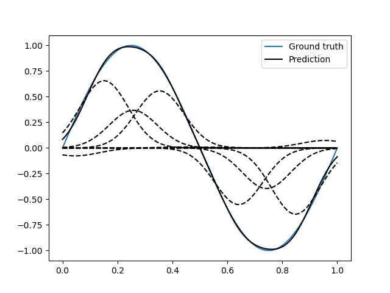
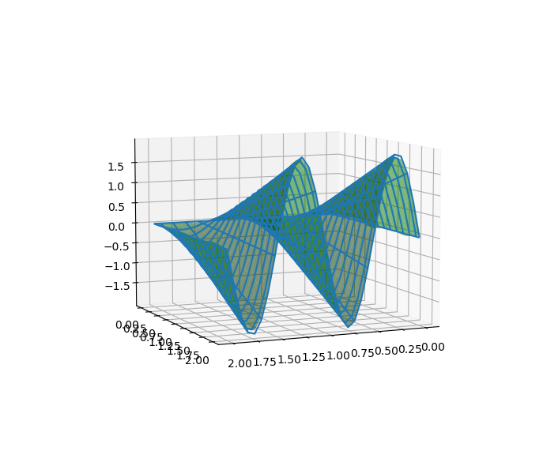
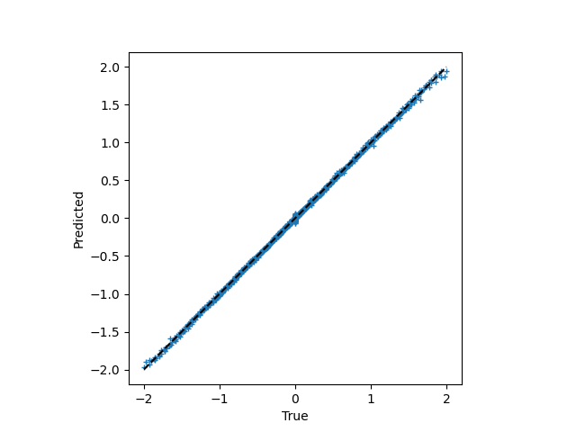
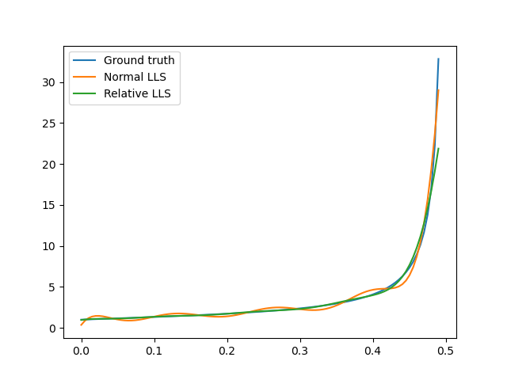

localreg
=========

.. image:: https://travis-ci.com/sigvaldm/localreg.svg?branch=master
    :target: https://travis-ci.com/sigvaldm/localreg

.. image:: https://coveralls.io/repos/github/sigvaldm/localreg/badge.svg?branch=master
    :target: https://coveralls.io/github/sigvaldm/localreg?branch=master

.. image:: https://img.shields.io/pypi/pyversions/localreg.svg
    :target: https://pypi.org/project/localreg

.. image:: https://zenodo.org/badge/185620541.svg
    :target: https://zenodo.org/badge/latestdoi/185620541

Smoothing of noisy data series through *local polynomial regression* (including LOESS/LOWESS), and radial basis function (RBF) neural network.

Installation
------------
Install from PyPI using ``pip`` (preferred method)::

    pip install localreg

Or download the GitHub repository https://github.com/sigvaldm/localreg.git and run::

    python setup.py install

Local polynomial regression
---------------------------

Introduction
~~~~~~~~~~~~
Local polynomial regression is performed using the function::

    localreg(x, y, x0=None, degree=2, kernel=rbf.epanechnikov, width=1, frac=None)

where ``x`` and ``y`` are the x and y-values of the data to smooth, respectively.
``x0`` is the x-values at which to compute smoothed values. By default this is the same as ``x``, but beware that the run time is proportional to the size of ``x0``, so if you have many datapoints, it may be worthwhile to specify a smaller ``x0`` yourself.

Local polynomial regression works by fitting a polynomial of degree ``degree`` to the datapoints in vicinity of where you wish to compute a smoothed value (``x0``), and then evaluating that polynomial at ``x0``. For ``degree=0`` it reduces to a weighted moving average. A weighting function or kernel ``kernel`` is used to assign a higher weight to datapoints near ``x0``. The argument to ``kernel`` is a pure function of one argument so it is possible to define custom kernels. The following kernels are already implemented:

- ``rectangular``
- ``triangular``
- ``epanechnikov``
- ``biweight``
- ``triweight``
- ``tricube``
- ``cosine``
- ``gaussian`` (non-compact)
- ``logistic`` (non-compact)
- ``sigmoid`` (non-compact)
- ``silverman`` (non-compact)

Having a kernel wich tapers off toward the edges, i.e., not a rectangular kernel, results in a smooth output.

The width of the kernel can be scaled by the parameter ``width``, which is actually half of the kernel-width for kernels with compact support. For kernels with non-compact support, like the Gaussian kernel, it is simply a scaling parameter, akin to the standard deviation. Having a wider kernel and including more datapoints lowers the noise (variance) but increases the bias as the regression will not be able to capture variations on a scale much narrower than the kernel window.

For unevenly spaced datapoints, having a fixed width means that a variable number of datapoints are included in the window, and hence the noise/variance is variable too. However, the bias is fixed. Using a width that varies such that a fixed number of datapoints is included leads instead to constant noise/variance but fixed bias. This can be acheived by specifying ``frac`` which overrules ``width`` and specifies the fraction of all datapoints to be included in the width of the kernel.

Example Usage
~~~~~~~~~~~~~
The below example exhibits several interesting features::

    import numpy as np
    import matplotlib.pyplot as plt
    from localreg import *

    np.random.seed(1234)
    x = np.linspace(1.5, 5, 2000)
    yf = np.sin(x*x)
    y = yf + 0.5*np.random.randn(*x.shape)

    y0 = localreg(x, y, degree=0, kernel=rbf.tricube, width=0.3)
    y1 = localreg(x, y, degree=1, kernel=rbf.tricube, width=0.3)
    y2 = localreg(x, y, degree=2, kernel=rbf.tricube, width=0.3)

    plt.plot(x, y, '+', markersize=0.6, color='gray')
    plt.plot(x, yf, label='Ground truth ($\sin(x^2)$)')
    plt.plot(x, y0, label='Moving average')
    plt.plot(x, y1, label='Local linear regression')
    plt.plot(x, y2, label='Local quadratic regression')
    plt.legend()
    plt.show()

If there's a slope in the data near an edge, a simple moving average will fail to take into account the slope, as seen in the figure, since most of the datapoints will be to the right (or left) of ``x0``. A local linear (or higher order regression) is able to compensate for this. We also see that as the frequency of the oscillations increases, the local linear regression is not able to keep up, because the variations become too small compared to the window. A smaller window would help, at the cost of more noise in the regression. Another option is to increase the degree to 2. The quadratic regression is better at filling the valleys and the hills. For too rapid changes compared to the kernel, however, quadratic polynomials will also start failing.

It is also worth noting that a higher degree also comes with an increase in variance, which can show up as small spurious oscillations. It is therefore not very common to go higher than 2, although localreg supports arbitrary degree.

.. [Hastie] T. Hastie, R. Tibshirani and J. Friedman *The Elements of Statistical Learing -- Data Mining, Inference, and Prediction*, Second Edition, Springer, 2017.
.. [Cleveland] W. Cleveland *Robust Locally Weighted Regression and Smoothing Scatterplots*, Journal of the Americal Statistical Associations, 74, 1979.

Radial basis function (RBF) network
-----------------------------------

Introduction
~~~~~~~~~~~~
An RBF network is a simple machine learning network suitable for mesh-free regression in multiple dimensions. It is robust, easy to understand, and although it is not a universal method, it works well for some problems.

A radial basis function is a function ``g(t)``, possibly with a multidimensional domain, but which only depends on the radial distance ``t`` of the input with respect to the origin of the RBF. An RBF network is then a weighted sum of such functions, with displaced centers::

    y_i = sum_j w_j g(||x_j-c_j||/r)

This sum is fitted to a set of data points ``(x,y)``. Typically, the RBF is a Gaussian function, although any it can be any function of one argument (the radial distance), for instance any of the kernals listed above. In ``RBFnet``, the centers ``c_j`` are first determined to get a good coverage of the domain by means of K-means clustering. The radius ``r``, here taken to be the same for all terms, is a hyperparameter to be tuned. With this, linear least squares is used to fit the weights ``w_j``.

Example 1
~~~~~~~~~
This example demonstrates how 10 radial basis functions can be used to fit a sine curve::

    from localreg import RBFnet
    import numpy as np
    import matplotlib.pyplot as plt

    x = np.linspace(0,1,100)
    y = np.sin(2*np.pi*x)

    net = RBFnet()
    net.train(x, y, num=10, radius=0.3)

    plt.plot(x, y, label='Ground truth')
    net.plot_bases(plt.gca(), x, label='Prediction')
    plt.legend()
    plt.show()

The dashed lines plotted using the ``plot_bases`` method are the individual terms in the weighted sum after training. The learning capacity of an RBF network is primarily determined by the number of basis functions, decided by the ``num`` parameter. In this case 10 basis functions makes for a good fit, but data with larger variability and more dimensions may require more basis functions. Other parameters that can be adjusted is the radius of the basis functions, as well as the analytical expression of the radial basis function itself. The radius is in terms of standard deviations of the input points, and is therefore always a number of order of magnitude one. By default Gaussian basis functions are used, but any of the kernels mentioned for local polynomial regression can be specified using the ``rbf`` parameter, as well as custom functions of one argument. Normalization can be turned off using the ``normalize`` argument. In this case the radius has similar magnitude as the input.

Example 2
~~~~~~~~~
This example demonstrates multi-dimensional inputs. Due to the larger variability more basis functions are needed than in example 1. We also do not specify the radius in this case, but allow ``RBFnet`` to use an internal algorithm for choosing the radius that minimizes the RMS error (other error measures may be specified using the ``measure`` parameter). While automatically tuning the radius works well in this example, it must be considered an experimental feature. It is also more time-consuming::

    from localreg import RBFnet, plot_corr
    import numpy as np
    import matplotlib.pyplot as plt
    from mpl_toolkits.mplot3d import Axes3D # Enables 3d-projection 

    x = np.linspace(0,2,30)
    X, Y = np.meshgrid(x, x)

    input = np.array([X.ravel(), Y.ravel()]).T
    x, y = input.T
    z = y*np.sin(2*np.pi*x)

    net = RBFnet()
    net.train(input, z, num=50)
    z_hat = net.predict(input)

    fig = plt.figure()
    ax = fig.add_subplot(111, projection='3d')
    ax.plot_wireframe(X, Y, z.reshape(X.shape), rcount=20, ccount=20)
    ax.plot_surface(X, Y, z_hat.reshape(X.shape), alpha=0.5, color='green')
    plt.show()

    fig, ax = plt.subplots()
    plot_corr(ax, z, z_hat)
    plt.show()

The figures show excellent agreement between the true and predicted data. In the first plot the wirefram is the true data, whereas the surface is the predicted data. The function ``plot_corr`` is handy to visualize the agreement between true and predicted data.

When using multi-dimensional data normalization becomes more important. If the input variables have different standard deviation, e.g., if they are variables of entirely different physical dimensions, it will be difficult to adapt the network with few basis functions of radial shape, because it will be difficult to resolve the details in the "small" axes while spanning the data in the "large" axes. Normalization make the spread along the axes more comparable.

Example 3
~~~~~~~~~
Localreg comes with several error metrics for quantifying the error:

- ``rms_error``
- ``rms_rel_error``
- ``max_abs_error``
- ``max_rel_error``
- ``mean_abs_error``
- ``mean_rel_error``
- ``error_bias``
- ``rel_error_bias``
- ``error_std``
- ``rel_error_std``

This example demonstates a couple of these, as well as a special modification to the least squares algorithm available in ``RBFnet``::

    from localreg import RBFnet
    from localreg.metrics import rms_error, rms_rel_error
    from frmt import print_table
    import matplotlib.pyplot as plt
    import numpy as np

    x = np.linspace(0,0.49,100)
    y = np.tan(np.pi*x)+1

    net = RBFnet()

    net.train(x, y, radius=1)
    y_hat0 = net.predict(x)

    net.train(x, y, radius=1, relative=True)
    y_hat1 = net.predict(x)

    print_table(
        [[''            , 'RMSE'              , 'RMSRE'                  ],
         ['Normal LLS'  , rms_error(y, y_hat0), rms_rel_error(y , y_hat0)],
         ['Relative LLS', rms_error(y, y_hat1), rms_rel_error(y , y_hat1)]]
    )

    plt.figure()
    plt.plot(x, y, label='Ground truth')
    plt.plot(x, y_hat0, label='Normal LLS')
    plt.plot(x, y_hat1, label='Relative LLS')
    plt.legend()
    plt.show()

Output::

                  RMSE  RMSRE 
    Normal LLS    0.65  0.17  
    Relative LLS  1.14  0.0457

This example fits the data to a tan-function, which becomes very large towards the right edge. Linear least squares (LLS) algorithms solves the so-called normal equations, which is equivalent to minimizing the squared sum of residuals or the root-mean-square (RMS) of the error. When the data spans a large range, the error can quickly become very large for the smaller values, because the algorithm optimizes the errors in absolute terms. In this example, the linear least squares algorithm makes a poor (and oscialltory) prediction of smaller values, because the absolute error in the larger values are made smaller that way. However, when working on data spanning several orders of magnitude, the relative error is often more important. By training with ``relative=True``, the normal equations are preconditioned such that the root-mean-square of the relative errors (RMSE) are minimized instead of RMSE.
